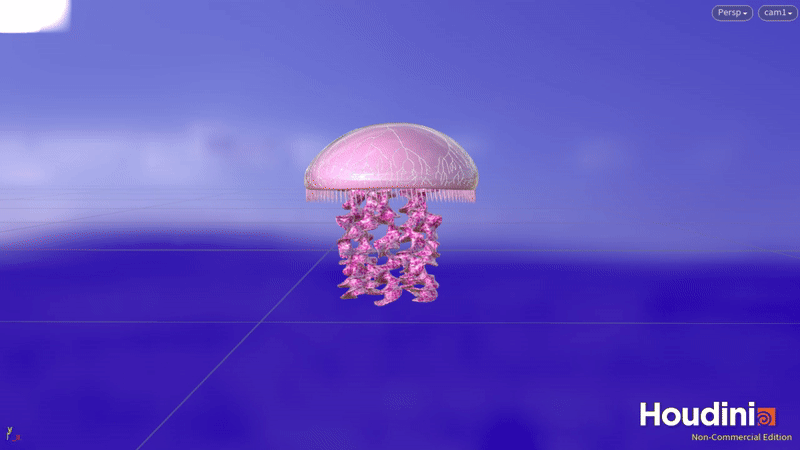
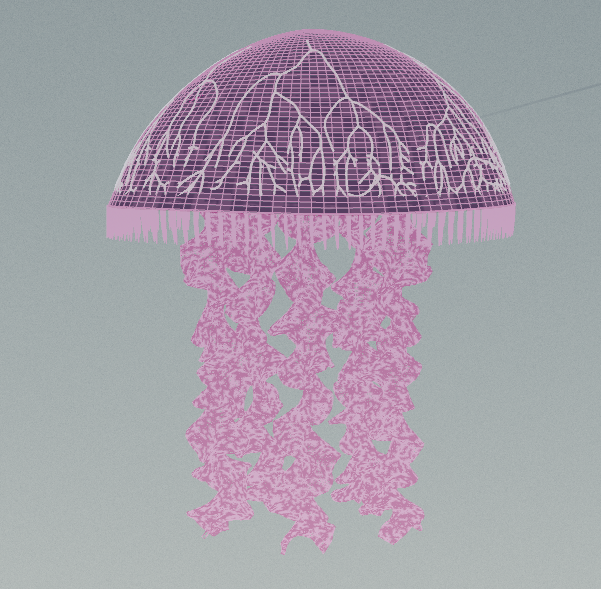
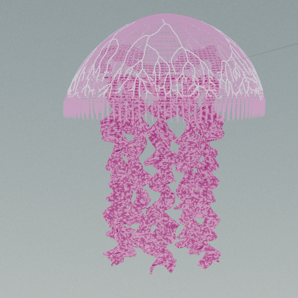
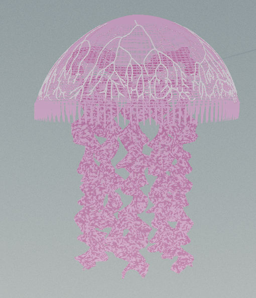
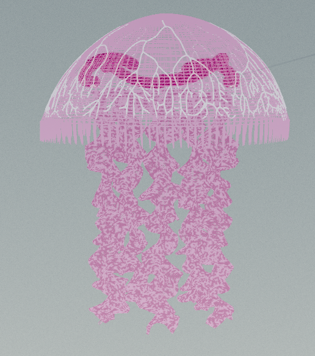
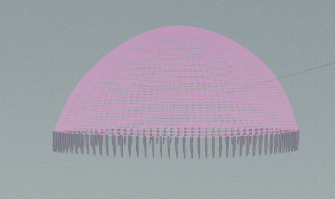

# Procedural Jellyfish 🪼

  

## Project Overview

I created a **procedural jellyfish** using _Houdini_, combining procedural modeling, simulation, and animation techniques.  
The goal was to construct all components of the jellyfish — **bell, arms, veins, organs, and tentacles** — and bring them together into a cohesive, animated result.

---

## Bell

  

The **bell** was built starting with a line that was bent from the tip and the main section to make a curve. Then revolved to make the semi-circle shape. Then transformations were applied to the y-translation and bend nodes to deform the shape.

---

## Arms

  

The **arms** started out as a grid that we added noise and twists to. I deformed it with respect to the bell (so that it moved with the bell) and used a cloth vellum constraint on it to give it a stretch-y look when animated.

---

## Veins

  

The **veins** were generated using the _Find Shortest Path_ node on a remeshed version of the bell. The veins were created by getting group ranges as the start and end points, which went into the _Find Shortest Path_ node. After resampling and smoothing, they were swept into tubes and deformed to move with the bell animation.

---

## Organs

  

The **organs** were lines that were bend, twisted, and swept into tubes.

---

## Tentacles

  

The **tentacles** were simulated using _Vellum Hairs_, with dynamic constraints tuned to create gentle underwater motion.  
Each tentacle was procedurally generated as lines from the bottom of the bell shape using curveu to specify the points.

---

## Final Animation

All components were combined and animated together using procedural controls for the bell pulse and vellum simulations for the tentacles and arms.

  

---

## 💭 Reflection

This project was an exciting deep dive into procedural workflows in Houdini. This was my second time using Houdini, so it was definitely a lot to learn, but overall it was a good process. Building each part from scratch and learning how to make them interact dynamically gave me a much stronger understanding of geometry networks, simulation setups, and procedural animation techniques.
